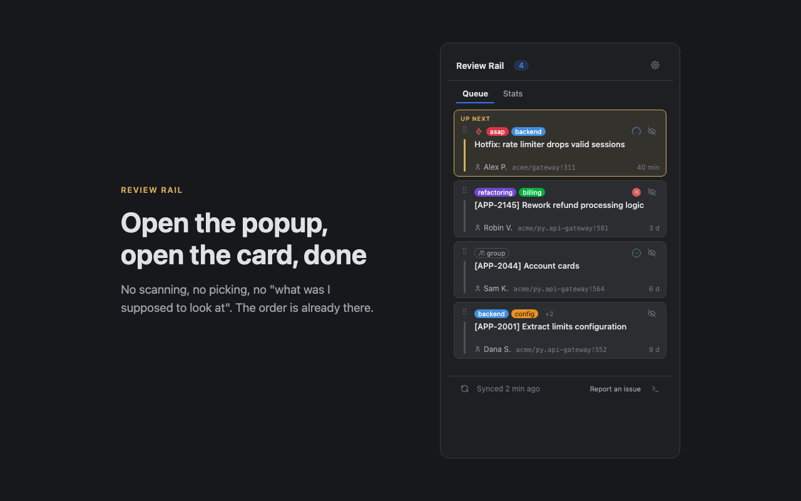

# Review Rail

Your code reviews, in the order you should do them.

Review Rail is a browser extension that keeps a personal, ordered
code-review queue. Most review tools are dashboards: they show you
everything that is open and leave the prioritizing to you. Review Rail
answers a narrower question — what to review next. You set the order,
urgent requests float to the top, and the first card is always the one
to open now. Works with gitlab.com and any self-hosted GitLab; everything
stays in your browser — a read-only token, no backend, no telemetry.



## Features

- **Ordered queue, not a list** — merge requests where you are a reviewer
  are picked up automatically. The top card is the one to review now;
  drag cards to set your own order. MRs carrying your urgency label
  (default `asap`) always stay above the rest.
- **Waiting sections** — after you request changes or comment, the MR
  leaves the queue (the ball is in the author's court) and moves to
  Changes requested / Commented below. When the author re-requests your
  review, it returns automatically.
- **Honest stats** — a review is counted only on real GitLab actions:
  an approval, a submitted review, or a merged or closed MR with your
  comments. There is
  no manual "count it" button. Today / week / month / all time, plus a
  16-week activity grid.
- **Hide without counting** — the eye-off button moves an MR to a
  collapsed Hidden list. The MR comes back when its state changes.
- **GitLab-native cards** — labels in their GitLab colors, project,
  author, age.
- **Diagnostic logs** — a local ring buffer with readable errors and
  hints, available from the popup footer.

## Privacy and permissions

There is no backend and no telemetry. The extension talks to exactly one
host — the GitLab server you configure — and to nothing else. See
[PRIVACY.md](PRIVACY.md).

| Permission | Why |
| --- | --- |
| `storage` | queue state, settings, and stats live in your browser |
| `alarms` | background polling every 5 minutes |
| host access (optional, single host) | requested at setup for the one GitLab URL you enter |

The access token requires the single scope **`read_api`**. The extension
is read-only by design: it cannot approve, comment, merge, or change
anything on your behalf.

## Platform support

| Platform | Status |
| --- | --- |
| GitLab (gitlab.com and self-hosted, 13.8+) | Supported |
| GitHub | Planned |

Reviewer-state features (Changes requested / Commented sections) need
GitLab 16.9+.

## Installation

### From the Chrome Web Store

*Link will appear here after publication.*

### From source (developer mode)

1. Clone this repository.
2. Open `chrome://extensions`, enable **Developer mode**.
3. Click **Load unpacked** and select the repository folder.

## Setup

1. Open the extension settings (gear icon in the popup).
2. Enter your GitLab URL — a link to the token creation page with the
   right scope pre-selected will appear.
3. Create a personal access token with the single scope **`read_api`**
   and paste it. The token is stored only in `chrome.storage.local`, is
   never displayed after saving, and is sent only to your GitLab host.
4. Optionally set the urgency label (default `asap`).

## What it deliberately doesn't do

- **No actions.** You cannot approve, merge, or comment from the
  extension. It shows the queue and takes you to GitLab — reviewing
  happens there.
- **No team features.** No reviewer assignment, no team dashboards, no
  metrics for managers. The queue is yours alone.
- **No cloud.** Nothing leaves your browser except API calls to your own
  GitLab host.

## Roadmap

See [ROADMAP.md](ROADMAP.md).

## Project structure

```
manifest.json        Manifest V3 (paths point into src/)
src/
  background.js      entry: message routing, settings
  bg/                background modules: sync engine, API wrapper, store/log
  lib/               pure logic, no chrome.* (fully unit-tested)
  popup/             queue + stats UI
  options/           settings page
  logs/              diagnostic log viewer
tests/               node:test, zero dependencies
icons/               extension icons (rendered from icons/src/*.svg by icons/generate.py)
```

## Development

Node.js 22+ is required only for tests — the extension itself has zero
dependencies and no build step:

```bash
npm test
```

## License

[MIT](LICENSE). Icon artwork is original. Some UI icon paths are based on
[Tabler Icons](https://tabler.io/icons) (MIT) — see
[THIRD-PARTY.md](THIRD-PARTY.md).
